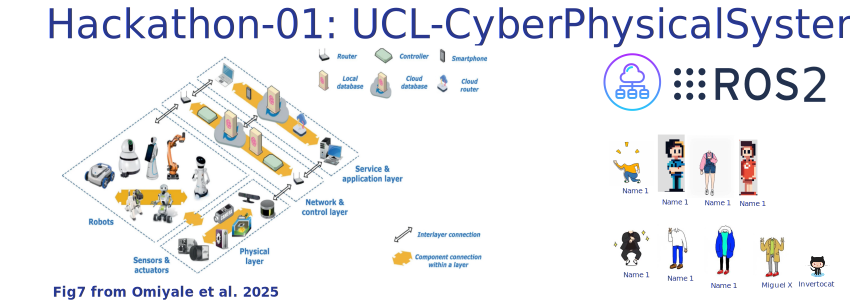

# :nut_and_bolt: Hacking cyber-physical systems with real-time data. 

## :scroll: Description
ARC and CEGE at UCL Here East are organising two hackathons using live sensor data, such as cameras, LiDAR, and motion tracking—from the cyber-physical lab in G40 at UCL Here East. The data will be made available to ARC staff via ARC’s computing infrastructure for projects exploring cyber-physical systems, embodied AI, and physical AI. Additionally, it is hoped that these hackathons will generate projects with new applications for the existing sensors beyond the current scope of manufacturing in aerospace. 

WHEN: Late January 2026 (TIP dates are 14/15 Jan 2026)
WHERE: UCL Here East (G40)

### Hackathon 1: Preliminary, small hackathon for feasibility and idea generation 
* WHO? 5-6 ARC staff, including someone from environments to aid in setting up VMs, other staff involved in current projects using live data would be useful, staff with knowledge of ROS 
* WHAT? Solve teething problems in network connectivity, VMs, ROS. Generate ideas for Hackathon 2, assessing feasibility and planning necessary work ahead of Hackathon 2. 

### Hackathon 2: Larger hackathon to explore ideas, create projects 
* WHAT? Explore project ideas in key areas of: Data (collection, processing, visualization), Machine Learning applied to live data, Live Data Infrastructure + Security, Robot Control. 
* WHO? 20-30 ARC staff – anyone interested, although it would be beneficial to include all Hackathon 1 attendees 

## :sparkles: Organisers, participants, and collaborators.

* ARC: UCL Advanced Research Computing Centre
Yagmur Ozdemir <yagmur.idil.ozdemir@ucl.ac.uk> 
Marlon Wijeyasinghe <m.wijeyasinghe@ucl.ac.uk>
Ruaridh Gollifer <r.gollifer@ucl.ac.uk>
James Legg <j.legg@ucl.ac.uk> 
Samantha Ahern, <s.ahern@ucl.ac.uk> 
Miguel Xochicale, <m.xochicale@ucl.ac.uk>
James Hetherington <j.hetherington@ucl.ac.uk>

* CEGE: UCL Civil, Environmental and Geomatic Engineering
Mickey Li, <mickey.li@ucl.ac.uk>
Chris Bendkowski,  <christopher.bendkowski.18@ucl.ac.uk>

## :school: Express interest
Registration is free. You can express your interest by commenting on this discussion ticket with your GitHub username, your availability, the skills you have, and the ones you’d like to learn [here](https://github.com/UCL-CyberPhysicalSystems/hackathon-01/discussions/categories/express-of-interest)

## :computer: TODISCUSS Pre-requisites 
* [ ] Highlight Hackathon 1 in Q4 2025 planning meeting to ensure attending staff will have availability. 
* [ ] Set up minimal ROS2 VM, test on ARC infrastucture ([dockerfile](https://github.com/mxochicale/nvidia-open-source-robot-lab/blob/main/Dockerfile))
* [ ] Test [zenoh bridge](https://github.com/eclipse-zenoh/zenoh-plugin-ros2dds), VPNs for connectivity between local networks 
* [ ] Participants are required to bring their own computers, either with a CPU or GPU. Computers with GPUs are ideal for prototyping models.
* [ ] VMs with GPUs? 
* [ ] GitHub username (or [sign up](https://docs.github.com/en/get-started/signing-up-for-github/signing-up-for-a-new-github-account) for a GitHub account if you don’t have one).
* [ ] Next meeting early November 2025 

## :date: TODISCUSS Agenda
The following is a general agenda that may be subject to slight changes.

### Day 01
| Time  | Activity  | 
| --- |--- |
| 08:30 - 09:00 | Arrival | 
| 09:00 – 09:15 | Welcome session | 
| 09:15 – 10:30 | Hacking: Introduction and preparation to hack  [:link:](day01.md) |
| 10:30 - 10:45 | Coffee break | 
| 10:45 - 12:30 | Hacking:  [:link:](day01.md) |
| 12:30 - 13:30 | Lunch break | 
| 13:30 - 15:00 | Hacking: [:link:](day01.md) |
| 15:00 - 15:15 | Coffee break | 
| 15:15 - 17:00 | Hacking:  [:link:](day01.md)  | 
| 17:30 onwards | Social |

### Day 02
| Time  | Activity  | 
| --- |--- |
| 09:00 – 10:30 | Hacking: [:link:](day02.md) |
| 10:30 - 10:45 | Coffee break | 
| 10:45 - 12:30 | Hacking: [:link:](day02.md) |
| 12:30 - 13:30 | Lunch break | 
| 13:30 - 15:00 | Hacking: [:link:](day02.md) |
| 15:00 - 15:15 | Coffee break | 
| 15:15 - 16:30 | Hacking: [:link:](day02.md)  | 
| 16:30 - 17:00 | Closing session  |

## :family: Forum
We are using [Discussions](https://github.com/UCL-CyberPhysicalSystems/hackathon-01/discussions) to explore activities, skills, demo requirements, and brainstorm ideas. 
It is a space to engage with other community members and welcome newcomers!

## :recycle: Contribution guidelines and code of conduct
* For full details on how to contribute to the project – including repository cloning and issue/branch/pull request workflows – please see the [CONTRIBUTING](https://github.com/UCL-CyberPhysicalSystems/hackathon-01/blob/main/CONTRIBUTING.md) guidelines.
* For information on our community standards, responsibilities and enforcement policies, refer to the [CODE OF CONDUCT](https://github.com/UCL-CyberPhysicalSystems/hackathon-01/blob/main/CODE_OF_CONDUCT.md).

