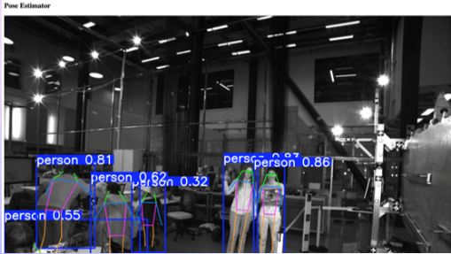
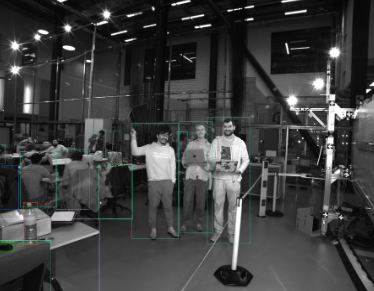

# Agenda

## :computer: Pre-requisites 
* GitHub username (or [sign up](https://docs.github.com/en/get-started/signing-up-for-github/signing-up-for-a-new-github-account) for a GitHub account if you don’t have one).
* Set up [UCL Virtual Private Network (VPN)](https://www.ucl.ac.uk/isd/services/get-connected/ucl-virtual-private-network-vpn)
* Set up SSH certificates [`~/.ssh/id_condenser.signed`](/ros2/condenser/README.md#setting-up-ssh-certificates)
* Participants must bring their own computers running Linux, macOS or Windows, with either a CPU or GPU. Machines with GPUs are preferred for local AI model prototyping. The minimum laptop requirements are: 8 CPU cores, 16 GB RAM, 30 GB of free disk space

## :date: Agenda
The following agenda is a general guide and may be subject to slight changes. 
In essence, a best practice is to document progress as we hack.

| Time  | Activity  | 
| --- |--- |
| 09:30 - 10:00 | Arrival registration and networking | 
| 10:00 – 10:15 | Welcome, introduction and objectives for the day | 
| 10:15 – 11:00 | Project pitches, team formation, onboarding & "document-as-you-hack" briefing |
| 11:00 - 12:30 | Hacking session 1 |
| 12:30 - 13:30 | Lunch break | 
| 13:30 - 15:00 | Hacking session 2 |
| 15:00 - 15:15 | Coffee break | 
| 15:15 - 17:00 | Hacking session 3 & final preparations | 
| 17:00 - 17:30 | Quick Demos, retrospective & planning next steps |
| 17:30 onwards | Networking & social |

## Few Highlights, Learnings, and Future Directions

### [Chris Bendkowski](https://github.com/ctbend), [Mickey Li](https://github.com/mhl787156), [Samantha Ahern](https://github.com/quirksahern), and  [Miguel Xochicale](https://github.com/mxochicale), 

We had an excellent tour and induction led by Mickey and Chris, including a walkthrough of sensor, camera, and LiDAR preparation at CEGE. The hands-on exposure provided valuable context for the technical work that followed. We also appreciate the quick response from Sam Reece and Brian Maher in setting up a GPU virtual machine in condenser, and from Sylve and Andrew at Unified AI for providing two user accounts. 

Highlights from the Hackathon 
* Strong participation from our ARC group (10 contributors). 
* Virtual machines with built GitHub container registries and dependencies were really useful for speeding up ROS2 prototyping. 
* Two teams successfully streamed data pipelines to run YOLO inference in real time using condensed CPU VMs. 
* Contributions were submitted and reviewed via pull requests on GitHub, demonstrating productive collaboration and solid engineering practice. 
* Initial LiDAR visualisation experiments were promising, though they require further refinement and system-level thinking. 
* It was encouraging to see cross-platform collaboration while configuring SSH keys across macOS, Windows, and Linux environments. 

### [Emily Dubrovska](https://github.com/pineapple-cat) and [Sofía Miñano](https://github.com/sfmig)

What we built. A ROS2 pipeline capable of publishing annotated image topics and recording them into a rosbag for local analysis and reproducibility.

What worked. Successfully recorded the annotated ROS2 image topic into a rosbag.
Replicated the pipeline on a GPU-enabled machine, indicating that GPU acceleration is likely active.

What didn’t work. Recreating the ROS2 node environment in a second Docker container exceeded VM disk capacity during dependency installation.

What could be improved (for larger events). Use tmux session management more systematically to avoid rebuilding environments and repeating setup steps.
Plan VM storage allocation more carefully when multiple containers and dependency installs are required.

Code and documentation contributions are [hackathon-yolo](../../ros2/hackathon-yolo/)

### [Mack Nixon](https://github.com/macknix), [Sunny Park](https://github.com/sungshic), and [Mahmoud Abdelrazek](https://github.com/razekmh)

What we built. Deployed a YOLO-ROS instance on VM2, later replicated on VM5.
Built a minimum viable pipeline (MVP) for facial expression estimation using an open-source model:
dima806/facial_emotions_image_detection.

What worked. Reliable access to Condenser infrastructure.
Successful use of the ROS-to-Condenser Docker image, enabling rapid ROS experimentation.
Basic vision pipeline integration with ROS through YOLO-based inference.

What didn’t work. 
 GPU access was difficult to obtain/configure, slowing experimentation.
Storage constraints on VMs, particularly when installing dependencies or handling image data.

What could be improved (for larger events). Provide more GPUs and clearer GPU allocation workflows.
Increase sensor availability (both number and diversity, e.g. LiDAR, RGB cameras, depth sensors).
Pre-provision larger storage volumes for VM environments.
Prepare preconfigured ROS + AI containers to reduce setup time.

Code and documentation contributions are [hackathon_yolo](../../ros2/hackathon_yolo/) and [hackathon-ml/](../../ros2/hackathon-ml/) 

### [Yagmur Ozdemir](https://github.com/yidilozdemir), [Ruaridh Gollifer](https://github.com/ruaridhg), and [Marlon Wijeyasinghe](https://github.com/mwij02), 

What we built. A ROS2 node for pose estimation, validating the end-to-end perception pipeline.
A workflow to record the /pose_estimator/annotated topic into a rosbag for reproducible local analysis.
An experimental setup using ROSBridge + SSH tunnelling to access ROS streams remotely, with roslibpy identified as a useful external interface.

What worked. Successfully deployed and ran the ROS2 node for pose estimation.
Recorded annotated image topics into rosbag, enabling reproducibility and offline analysis.
Replicated the workflow on a GPU-enabled machine, suggesting GPU acceleration for inference.

What didn’t work. LiDAR streaming was unstable, with intermittent data availability and slow throughput.
Switching to cameras exposed device access issues on VM node 4.
Large ROS messages limited performance when streaming remotely via ROSBridge.

What could be improved (for larger events). Provide pre-configured Docker images with ROS2 and dependencies ready to run.
Ensure stable and tested sensor pipelines (LiDAR, cameras, etc.) before the event.
Improve VM resource allocation, particularly for GPU access, networking, and storage.