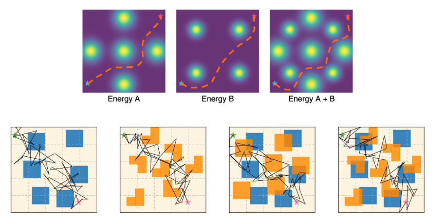
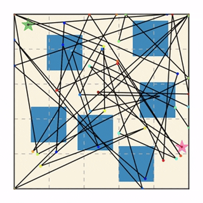
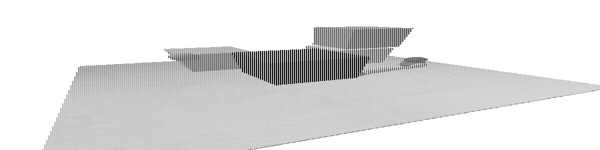

# Potential Based Diffusion Motion Planning

Potential Based Diffusion Motion Planning and Generalization. This approach learns different potential functions over motion planning trajectories. In test time, different potentials can be directly combined and optimized to construct new motion plans. This method directly generalizes to cluttered heterogeneous environments (right two) via composing potentials, while the potential functions are only trained on simple homogeneous environments (left two).



## Run notebook
```bash
source .venv/bin/activate
uv run jupyter lab 
```

## Notebooks
* [eval_maze2d_demo.ipynb](eval_maze2d_demo.ipynb)    



* [eval_kuka7d_base.ipynb](eval_kuka7d_base.ipynb)


## Notes
* The Python dependencies require torch, which downloads several `nvidia_cuda*` packages. This process takes around five minutes, but it might be better to use a shared environment so that all users work with the same setup.
* The data from the pre-trained model and the Maze2D environment files are as follows: Model: model-maze2d-static1-base.zip (116 MB, 6 July 2024). Environment: maze2d-static1-base.zip (552 MB, 6 July 2024). These files could also be shared among all users to save time and storage.
* Maybe https://github.com/jupyterlab/jupyterlab-git might be a good option to commit/push changes to public repos?


## Referenc
* https://github.com/devinluo27/potential-motion-plan-release
* https://arxiv.org/pdf/2507.04384


