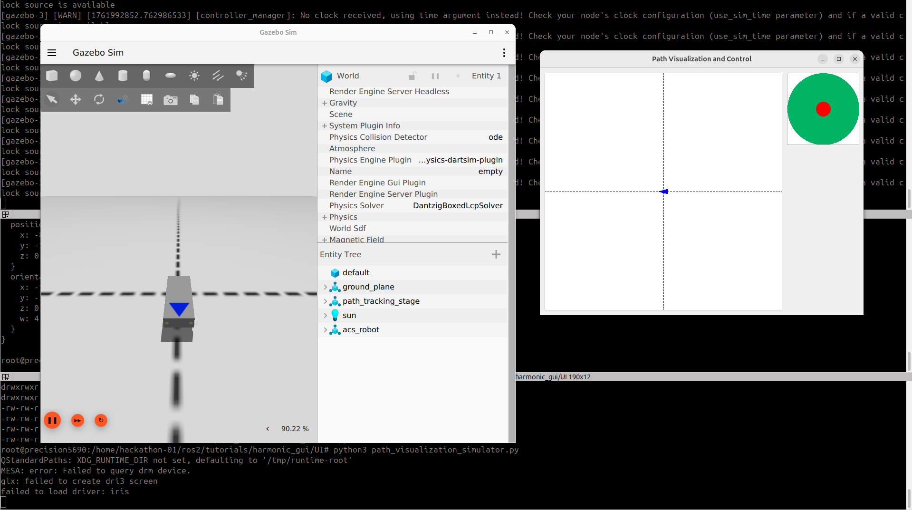

# Robot State Visualization and Control

* Code: https://drive.google.com/drive/folders/1qRyeqFk1crV68H3dioz4YGdWjbULWmTh
* Video: https://www.youtube.com/watch?v=u54WAlAewMU



Run container
```bash
cd ros2/cuda
PROFILE=ros2cuda && ROS_DISTRO=jazzy && VERSION_ID=0.0.2
bash run-ros2cuda.bash $PROFILE $ROS_DISTRO $VERSION_ID
```

Build ros packages and lauch it
```bash
cd /home/hackathon-01/ros2/examples/harmonic_gui
colcon build --base-paths src
source /home/hackathon-01/ros2/examples/harmonic_gui/install/setup.bash
ros2 launch robot_gazebo main.launch.py 
```

[new terminal]  Explore gz topics
```bash
source /home/hackathon-01/ros2/examples/harmonic_gui/install/setup.bash
gz topic --list
gz topic -i -t /model/acs_robot/pose #information
gz topic -e -t /model/acs_robot/pose #echo content
```

[new terminal] ros2topics
```bash
docker exec -it $(docker container ls  | grep "${PROFILE}-${ROS_DISTRO}:${VERSION_ID}" | awk '{print $1}') bash
source /home/hackathon-01/ros2/examples/harmonic_gui/install/setup.bash

ros2 topic list
ros2 topic echo /model/acs_robot/pose 

#run simulation
cd /home/hackathon-01/ros2/examples/harmonic_gui/UI
python3 path_visualization_simulator.py
```


