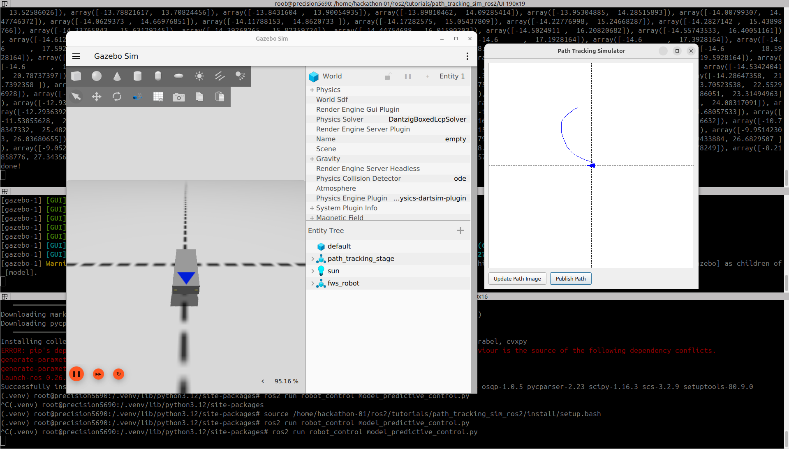

# Path Tracking Algorithm Simulation in ROS2

Code: https://drive.google.com/drive/folders/1whczoN0XLgl3wqbGHqMemEAvdWoba8Ep
Video: https://www.youtube.com/watch?v=uls-WmxRiTw



Run container
```bash
bash run-ros2cuda.bash
```

Build ros packages
```bash
cd /home/hackathon-01/ros2/tutorials/path_tracking_sim_ros2
colcon build --base-paths src
```

Run tracking simulator script
```bash
python3 /home/hackathon-01/ros2/tutorials/path_tracking_sim_ros2/UI/path_tracking_simulator.py
#TODO check the following logs
 #QStandardPaths: XDG_RUNTIME_DIR not set, defaulting to '/tmp/runtime-root'
 #MESA: error: Failed to query drm device.
 #glx: failed to create dri3 screen
 #failed to load driver: iris
```

Run the main lunch script in a new terminal
```bash
docker exec -it $(docker container ls  | grep 'ros2:cuda' | awk '{print $1}') bash
source /home/hackathon-01/ros2/tutorials/path_tracking_sim_ros2/install/setup.bash
ros2 launch robot_gazebo main.launch.py
#TOSOLVE
 #[ros2-5] Failed loading controller joint_state_broadcaster check controller_manager logs
 #[ros2-6] Failed loading controller forward_velocity_controller check controller_manager logs
 #[ros2-7] Failed loading controller forward_position_controller check controller_manager logs
```

Run the Model Predictive Control
```bash
#TODO create a python environment within docker file to install depencies or a `ros_workspace`
python3 -m venv .venv
source .venv/bin/activate
export PYTHONPATH='/opt/ros/jazzy/lib/python3.12/site-packages:/.venv/lib/python3.12/site-packages/'
export PYTHONPATH='/opt/ros/jazzy/lib/python3.12/site-packages'
python3 -m pip install cvxpy
```

```bash
source /home/hackathon-01/ros2/tutorials/path_tracking_sim_ros2/install/setup.bash
ros2 run robot_control model_predictive_control.py 
```

