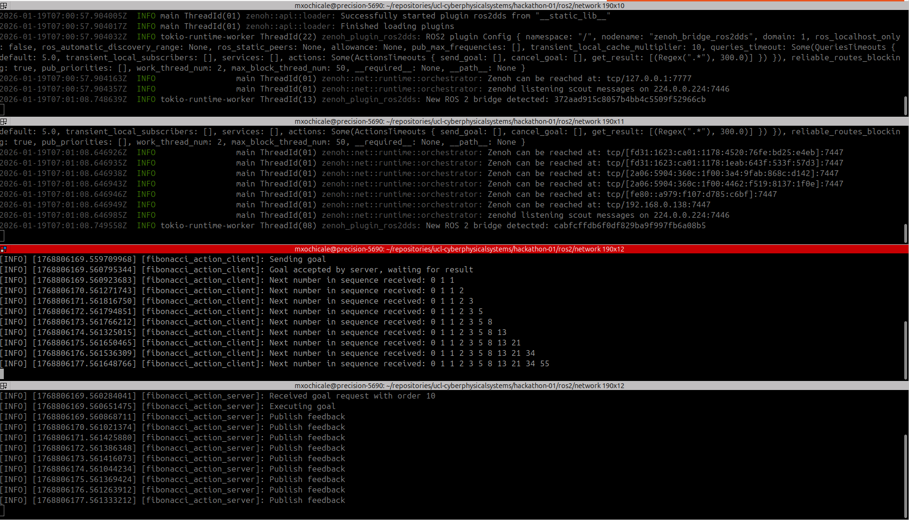

# Use zenoh-bridge-ros2dds with ROS2 Humble
> "DDS works best within a local network (LAN), but it struggles when communication needs to cross WAN, NAT, or firewalls. Zenoh, on the other hand, is lightweight and efficient, designed to scale from embedded devices up to cloud systems. Its optimized routing reduces the bandwidth overhead caused by DDS discovery floods, making remote ROS 2 communication both feasible and resource-friendly, even in large or bandwidth-constrained networks."
https://medium.com/@piliwilliam0306/use-zenoh-bridge-ros2dds-with-ros2-humble-459ab70ce9c7

## Run ROS2 with pre-installed dependnecies
```bash
cd ros/network
PROFILE=network && ROS_DISTRO=humble && VERSION_ID=0.0.1
bash run-ros2.bash $PROFILE $ROS_DISTRO $VERSION_ID
```

## Download and extract standalone binaries for zenoh-bridge-ros2dds
```
# Change preferred zenoh version here
export ZENOH_VERSION=1.5.0

# install unzip and wget if missing
sudo apt install unzip wget

# Download and extract zenoh-bridge-ros2dds release
wget -O zenoh-plugin-ros2dds.zip https://github.com/eclipse-zenoh/zenoh-plugin-ros2dds/releases/download/$ZENOH_VERSION/zenoh-plugin-ros2dds-$ZENOH_VERSION-x86_64-unknown-linux-gnu-standalone.zip
unzip zenoh-plugin-ros2dds.zip

# Download and extract released standalone binaries of zenoh router
wget -O zenoh.zip https://github.com/eclipse-zenoh/zenoh/releases/download/$ZENOH_VERSION/zenoh-$ZENOH_VERSION-x86_64-unknown-linux-gnu-standalone.zip
unzip zenoh.zip
```


## Test using different Domain IDs
```bash
# terminal1
./zenoh-bridge-ros2dds -d 1 -l tcp/127.0.0.1:7777
```

```bash
# terminal2
./zenoh-bridge-ros2dds -d 2 -e tcp/127.0.0.1:7777
```

```bash
# terminal3: Run fibonacci_action_client node
source /opt/ros/humble/setup.bash
export RMW_IMPLEMENTATION=rmw_cyclonedds_cpp
DOMAIN_ID=1 ros2 run action_tutorials_cpp fibonacci_action_client
```

```bash
# terminal4: Run fibonacci_action_server node
source /opt/ros/humble/setup.bash
export RMW_IMPLEMENTATION=rmw_cyclonedds_cpp
DOMAIN_ID=2 ros2 run action_tutorials_cpp fibonacci_action_server
```

See example of terminal outputs

