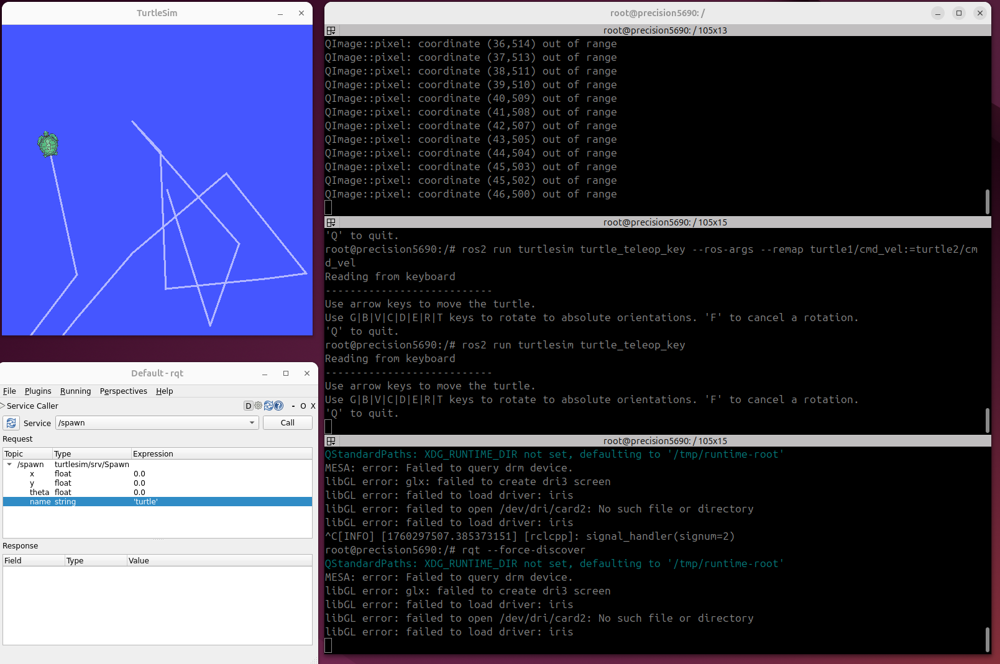

# Using turtlesim, ros2, and rqt
Goal: Install and use the turtlesim package and rqt tools to prepare for upcoming tutorials. 

https://docs.ros.org/en/humble/Tutorials/Beginner-CLI-Tools/Introducing-Turtlesim/Introducing-Turtlesim.html

